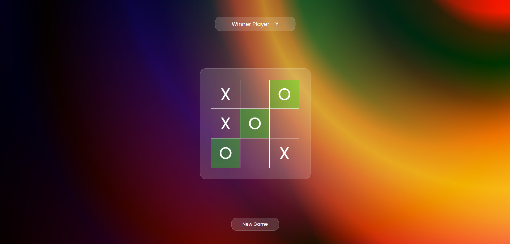

Tic Tac Toe Game
This is a simple implementation of the classic game Tic Tac Toe using HTML, CSS, and JavaScript. The game allows two players to take turns and compete against each other to get three of their markers in a row, column, or diagonal.

Tic Tac Toe Screenshot: 

Table of Contents
Features, 
Getting Started, 
Prerequisites, 
Installation, 
How to Play, 
Game Rules, 
Contributing, 
License

Feature:

Two-player gameplay (Player X and Player O).
Interactive grid to make moves.
Automatically switches between players after each move.
Displays a victory message when a player wins.
Supports restarting the game without refreshing the page.
Getting Started
Follow these instructions to get a copy of the project up and running on your local machine.

Prerequisites:
Make sure you have a web browser installed on your computer.

Installation
Clone the repository:
>bash

>Copy code

>git clone https://github.com/your-username/tic-tac-toe.git

>Navigate to the project directory:

>bash

>Copy code

>cd tic-tac-toe

>Open the index.html file in your web browser.

How to Play:

Open the game in your web browser.

Player X starts the game. Click on an empty cell to make a move. The cell will be marked with an "X".

Player O takes the next turn. Click on another empty cell to make a move. The cell will be marked with an "O".

The game continues with players taking turns until one player gets three markers in a row, column, or diagonal.

If a player wins, a victory message will be displayed. Click the "Restart" button to start a new game.

Game Rules:
Players take turns to place their markers on the grid.
The objective is to get three of your markers in a row (horizontally, vertically, or diagonally).
The game ends when one player wins or there are no more empty cells.
If no player achieves three markers in a row and no more moves are possible, the game ends in a draw.
Contributing
Contributions are welcome! If you find any issues or have suggestions for improvements, feel free to open an issue or create a pull request.

Fork the project:
Create your feature branch: git checkout -b feature/new-feature
Commit your changes: git commit -am 'Add a new feature'
Push to the branch: git push origin feature/new-feature
Open a pull request.

Enjoy playing Tic Tac Toe! If you have any questions or feedback, please don't hesitate to contact us.
